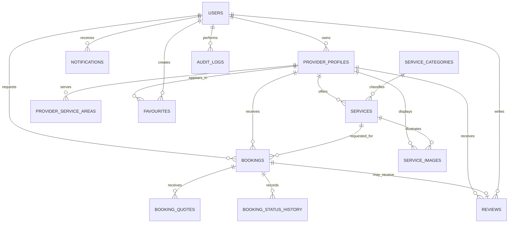

## 8. Entity Relationship Diagram

```mermaid
erDiagram
    USERS ||--o{ PROVIDER_PROFILES : owns
    USERS ||--o{ BOOKINGS : requests
    USERS ||--o{ NOTIFICATIONS : receives

    PROVIDER_PROFILES ||--o{ SERVICES : offers
    PROVIDER_PROFILES ||--o{ SERVICE_IMAGES : displays
    PROVIDER_PROFILES ||--o{ PROVIDER_SERVICE_AREAS : serves
    PROVIDER_PROFILES ||--o{ BOOKINGS : receives
    PROVIDER_PROFILES ||--o{ FAVOURITES : appears_in
    PROVIDER_PROFILES ||--o{ REVIEWS : receives

    SERVICE_CATEGORIES ||--o{ SERVICES : classifies
    SERVICES ||--o{ SERVICE_IMAGES : illustrates
    SERVICES ||--o{ BOOKINGS : requested_for

    BOOKINGS ||--o{ BOOKING_QUOTES : receives
    BOOKINGS ||--o{ BOOKING_STATUS_HISTORY : records
    BOOKINGS ||--o| REVIEWS : may_receive

    USERS ||--o{ REVIEWS : writes
    USERS ||--o{ FAVOURITES : creates
    USERS ||--o{ AUDIT_LOGS : performs
```
